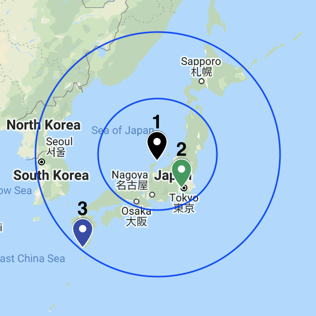
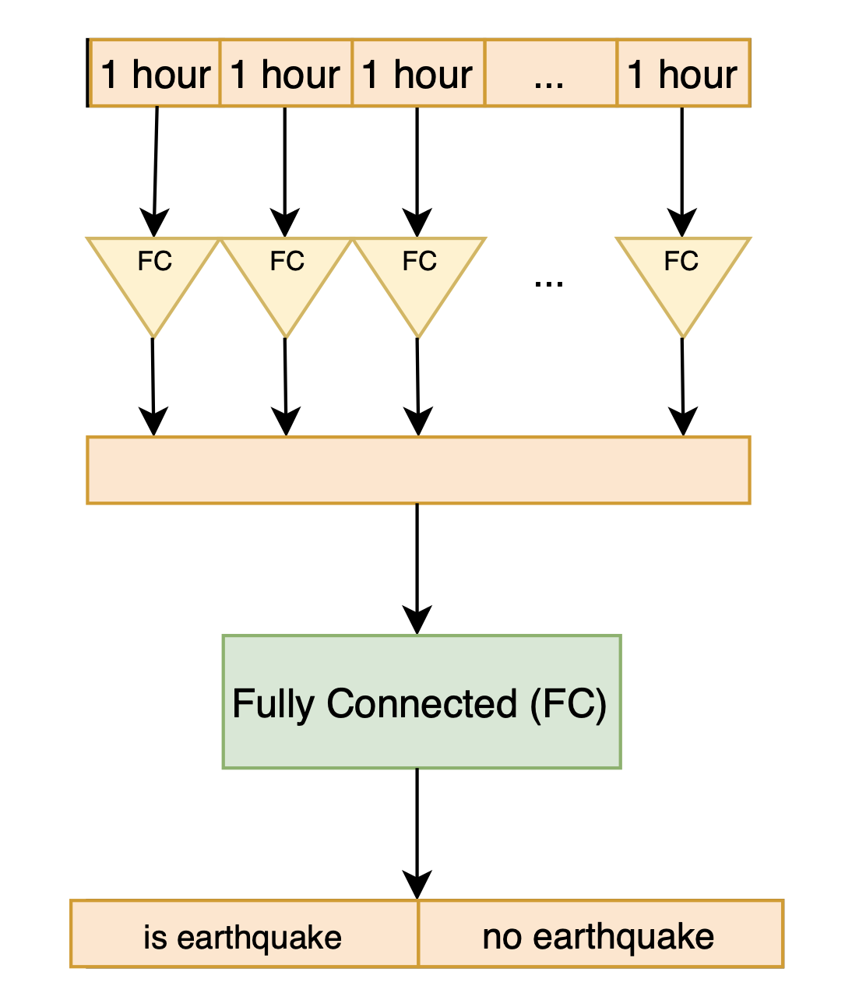

# significant-earthquake-predictors

This repository was created as a part of research in Saint Petersburg State University. We provide two types of datasets with cleaned data and filled NaNs. We also provide several models for feature selection.

The data is consists of:
* more than 300 ionosondes from 2 different sources
* earthquakes data (1992 - 2020)

### Prerequisites

Install [pytorch](https://pytorch.org) before running the Neural network model. 

### Data

Data about earthquakes was taken from [USGS website](https://www.usgs.gov/natural-hazards/earthquake-hazards/earthquakes)

The ionosphere data was taken from:
* National centers for environmental information [NOAA](https://www.ngdc.noaa.gov/stp/iono/ionogram.html)
* National Institute of Information and Communication Technology in Japan [NICT](http://wdc.nict.go.jp/IONO/HP2009/ISDJ/index-E.html) 

The data from NICT dataset was not used in further experiments due to different parameters set. But it should be used in the future reasearch.

All the data in both ionosphere data sources is in a 15-minutes time format.

### Missing values

The data with more than 50% of missing values was not considered. 
The data were grouped by earthquake id, date and time and then the missing values were filled with mean of such group.

### Datasets

We applied two approaches when creating datasets.

1. Described in the [paper by Pulinets 2004](https://www.researchgate.net/publication/215972520_Ionospheric_Precursors_of_Earthquakes_Recent_Advances_in_Theory_and_Practical_Applications) this approach based on the earthquake preparation zone. We consider pairs of sondes - one inside the preparation zone, the other one - outside. 

Then the data was aggregated by an hour and was flattened in a way that 1 earthquake is 1 sample (1 row) - to do this each feature was renamed in a next way `feature-name_nday_nhour`. Where `nday` - number of days before the earthquake and `nhour` - number of hour in the day `nday` (from 0 to 23).
The files with data are located in the <em>NOAA/datasets_LR_model</em>
The structure of the file is presented below:

| D_0_0   |   D_0_1|  D_0_2 |  ...|  D_7_23 | ... | foF2_0_0 |  ...  | foF2_7_23 | res |
|-------  |:------:|------:|------:|------:|------:|------:  |------:|------:|------:|
| 3000.0  |  3003.1| 3001.1 | ... | 3001.1 |  ... | 5.925    | ...   | 6.43  |0    |
 

The other version of the same data with 30 minutes data samples which were not flattened and were used for NN model is located at <em>NOAA/datasets_NN_model/sondes_in_ml.csv (should be taken as positive sample) and sondes_out_ml.csv</em> (should be taken as negative sample)

The structure of the file is presented below, where `id` is an earthquake id, `h` and `m` - time:

| foF2   |   D     |  M(D)      |  ...|  id         | date    | nday   |  h    | m      | 
|-------  |:------:|------:|------:   |------:       |------: |------:  |------:|------:|
| 5.925   |  3003.1| 2.285      | ... | ak0028jvqcwp | 2002-06-21 | 7   |0  | 0  |

2. We take data from sondes inside the preparation zone as positive samples. Then we took data from the same sondes but 1 year ago of 1 year after the earthquake (in case if there were no other earthquakes registered at that time). Then the data were flatten in a way that 1 earthquke is 1 sample (1 row) to run the LinearRegression. The file is located in the <em>NOAA/datasets_LR_model/flattened_ds_y_ago_y_after_7days.csv</em>
The other version of the same data which was not flattened and was used for NN model is located at <em>NOAA/datasets_NN_model/sondes_in_ml.csv and sondes_year_before_after_ml.csv</em>

All the datasets are stored if .csv format with separator = ','

### Models
Several different modes were used for feature selection and feature creation (PCA).

#### Linear Regression + PCA

This experiment and models is at <em>models/PCA_Logistic_Rigression.ipynb</em>

#### Linear Regression + L1 regularisation

Feature selection with L1 regularization id at <em>models/L1_feature_selection.ipynb</em>

#### Neural network

Feature selection with NN regularization id at <em>models/NN_ablation_test.ipynb</em>

The Neural network architecture is described at the image below:

## Acknowledgments

* The data from NOAA was taken from <em>https://github.com/DaryaChaplygina/ionoshpere_dataset</em> 
* This research was inspired by the work above
